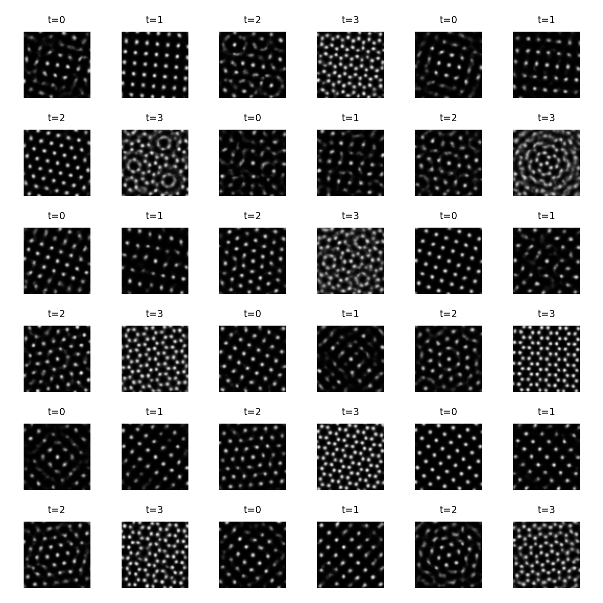
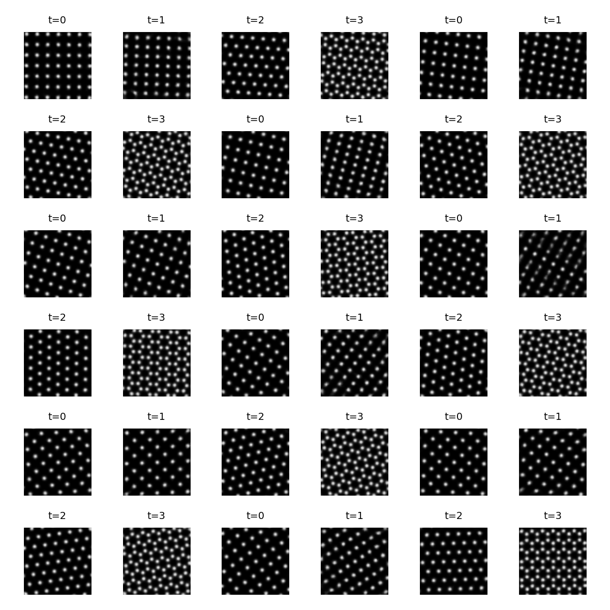
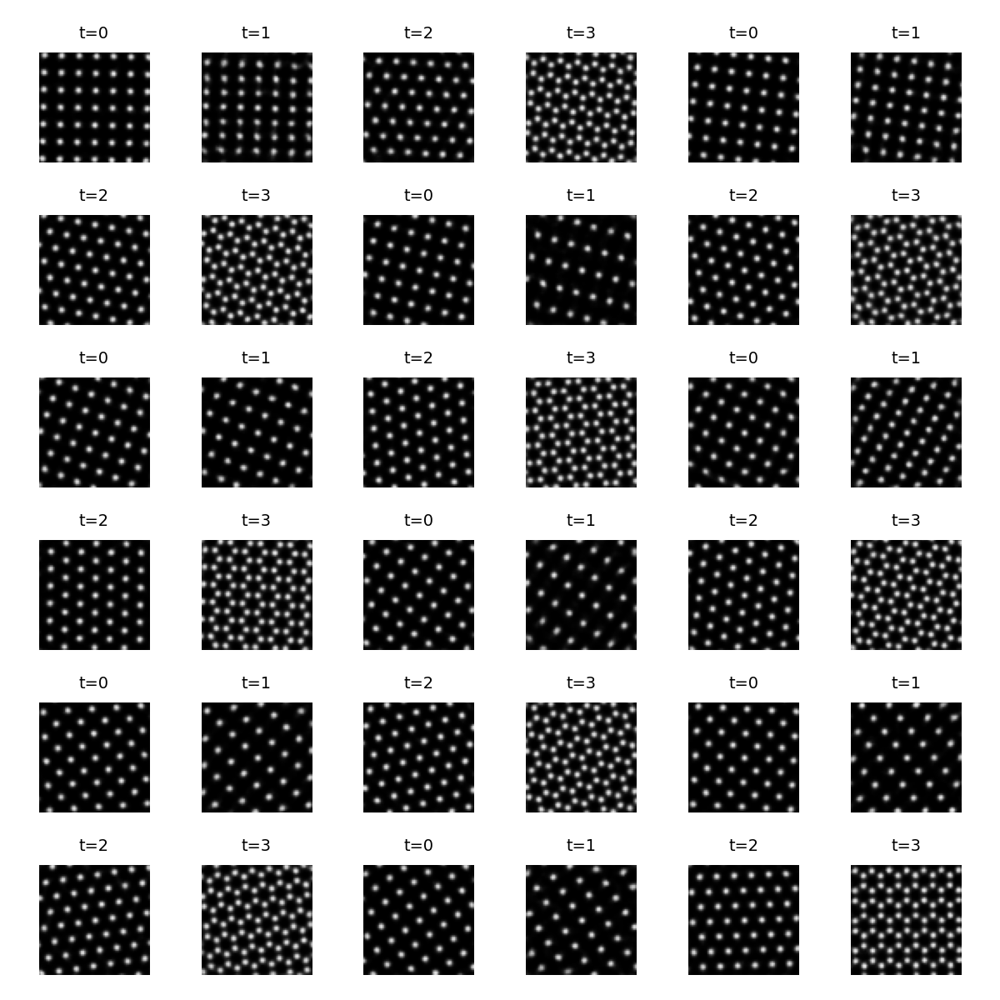

# ToyCrystals — conditional generation on synthetic lattice images

This repo explores **conditional generation** on a synthetic *toy-crystals* dataset: periodic lattice images rendered as Gaussian “atoms”.

It implements and compares three approaches:

1. **VAE + standard prior** (baseline; sample $z \sim \mathcal{N}(0, I)$, then decode)
2. **VAE + learned diffusion prior in latent space** (train a DDPM-style prior on cached VAE latents; DDIM sampling)
3. **Direct score-based diffusion on images** (train a score model on pixels with VP-SDE; reverse-SDE/ODE sampling, no VAE)

Score-based diffusion notation is aligned with the MIT diffusion course lecture notes ([PDF](https://diffusion.csail.mit.edu/docs/lecture-notes.pdf)). 

See [`docs/reproduce.md`](docs/reproduce.md) for the exact commands used for the reported runs.

## Results

### Qualitative

<div align="center"><b>VAE reconstructions</b></div>
<p align="center">
  
</p>

<div align="center"><b>Sampling comparison (same conditioning distribution)</b></div>

<div align="center">
<table>
  <tr>
    <td align="center">
      <b>VAE + standard prior</b><br/>
      <sub>z ~ N(0, I)</sub><br/>
      
    </td>
    <td align="center">
      <b>VAE + latent diffusion prior</b><br/>
      <sub>DDIM sampling in latent space</sub><br/>
      
    </td>
  </tr>
  <tr>
    <td align="center">
      <b>VAE + MoP reference</b><br/>
      <sub>posterior-based baseline</sub><br/>
      
    </td>
    <td align="center">
      <b>Direct VP-SDE</b><br/>
      <sub>reverse-SDE sampler</sub><br/>
      
    </td>
  </tr>
</table>
</div>

### Quantitative (held-out test set)

Scores are computed on the held-out test split using 2,048 real and 2,048 generated samples per method (see `docs/reproduce.md`). We report `mass_w1` and `fft_radial_l2` as simple, fast proxies for global intensity and lattice frequency structure, respectively.

Lower values indicate a closer match to the test distribution.

<div align="center">

| method | mass_w1 (1e<sup>-3</sup>) | fft_radial_l2 (1e<sup>-3</sup>) |
|---|---:|---:|
| VAE + standard prior | 11.48 | 2.18 |
| VAE + diffusion prior (DDIM 400) | **1.44** | 0.31 |
| VAE + MoP (posterior-based reference) | 3.07 | **0.26** |
| VP-SDE (reverse-SDE sampler) | 2.02 | 0.58 |
| VP-SDE (probability-flow ODE) | 8.11 | 1.73 |

</div>

Takeaway: the **latent diffusion prior** provides the best overall match on these two simple metrics.

The MoP is a posterior-based, data-anchored baseline that samples from a finite pool of encoded training examples. It preserves individual examples but does not explicitly optimize these distribution-level metrics (mean intensity and radial FFT), so it can score lower than a learned diffusion prior on them.

## Quickstart

Prereqs: Python 3.10+ and PyTorch (installed separately).

Install:

```bash
pip install -e .
```

Smoke test (CPU, no dataset files): trains a small VAE for a couple epochs and writes preview PNGs to `results/`.

```bash
python scripts/train_vae.py --device cpu --epochs 2 --n-samples 5000 --data-path ""
```

For the exact commands used to reproduce the figures and reported numbers (including dataset `.pt` files and evaluation), see `docs/reproduce.md`.

## Dataset

Each sample is a single-channel image $x \in [0,1]^{1\times H\times W}$ containing a periodic lattice (Gaussian “atoms”).

We train conditionally on $c$, consisting of:

- a categorical **lattice type** $c_{\mathrm{cat}}$
- continuous **rotation / geometry features** $c_{\mathrm{cont}}$ (encoded as a small vector; e.g. sine/cosine-style features)

Datasets are stored as `.pt` tensors on disk (see `scripts/build_dataset.py`).

The synthetic generator in `src/toycrystals/data.py` can also vary lattice spacing, vacancies, and jitter; the `--rot-only` / `--simple` flags in `scripts/build_dataset.py` restrict these to simpler variants used for these specific results.

## Models

### Conditional VAE

We use a conditional VAE with encoder $q_\phi(z\mid x,c)$ and decoder $p_\theta(x\mid z,c)$, with a standard Normal prior $p(z)=\mathcal{N}(0,I)$.

**Objective (negative ELBO)**

$$
\mathcal{L}_{\mathrm{VAE}}(\theta,\phi) = \mathbb{E}_{q_\phi(z\mid x,c)}\big[-\log p_\theta(x\mid z,c)\big] + \beta \cdot \mathrm{KL}\big(q_\phi(z\mid x,c) \| \mathcal{N}(0,I)\big).
$$

Key point: even with a moderate $\beta$, the *aggregated posterior*

$$
q(z\mid c)=\mathbb{E}_{x\sim p_{\mathrm{data}}(x\mid c)}\left[q_\phi(z\mid x,c)\right]
$$

can be a poor match to $\mathcal{N}(0,I)$. This is why standard-prior sampling $z\sim\mathcal{N}(0,I)$ can produce “off-manifold” artefacts, even if reconstructions are good.

### Latent diffusion prior

Instead of sampling $z\sim\mathcal{N}(0,I)$, we train a diffusion model in **latent space** to approximate a better conditional prior $p_\psi(z\mid c)$.

We train on cached VAE latents, typically the posterior mean $z_0 = \mu_\phi(x,c)$.

**Forward noising process (DDPM form)**  
With $\alpha_t = 1-\beta_t$ and $\bar\alpha_t = \prod_{s=1}^t \alpha_s$:

$$
z_t = \sqrt{\bar\alpha_t} \cdot z_0 + \sqrt{1-\bar\alpha_t} \cdot \varepsilon.
$$

where $\varepsilon \sim \mathcal{N}(0,I)$.

**Training objective (noise prediction)**

$$
\mathcal{L}_{\mathrm{diff}}(\psi)=
\mathbb{E}_{t,\varepsilon,z_0,c}\left[\lVert \varepsilon - \varepsilon_\psi(z_t,t,c) \rVert_2^2\right].
$$

Sampling uses DDIM-style updates (deterministic, fewer steps; $\eta=0$ only in current code) or the full $T$-step process, producing $z_0\sim p_\psi(z\mid c)$ which is decoded by the VAE: $x\leftarrow p_\theta(x\mid z_0,c)$.

### Direct score-based diffusion (VP-SDE)

We also train a score model directly on images (no VAE) using the VP-SDE parameterisation:

$$
dx = -\tfrac12\beta(t) \cdot x \cdot dt + \sqrt{\beta(t)} \cdot dw_t.
$$

The reverse-time SDE has drift that depends on the score $\nabla_x\log p_t(x\mid c)$:

$$
dx =
\left[-\tfrac12\beta(t)x - \beta(t)\nabla_x\log p_t(x\mid c)\right]dt
+\sqrt{\beta(t)} \cdot d\tilde{w}_t.
$$

Here $w_t$ denotes standard Brownian motion and $\tilde{w}_t$ the reverse-time noise process (another Brownian motion). In discrete time, both increments satisfy $dw_t \sim \mathcal{N}(0, dt)$, i.e., $dw_t = \sqrt{dt}\cdot\epsilon$ with $\epsilon \sim \mathcal{N}(0,1)$.

The associated probability-flow ODE is:

$$
\frac{dx}{dt} = -\tfrac12\beta(t)x - \tfrac12\beta(t)\nabla_x\log p_t(x\mid c).
$$

At sampling time we use either the reverse-SDE sampler (stochastic) or the probability-flow ODE (deterministic).

**Training objective (noise prediction)**  
We parameterize the score via noise prediction: $\nabla_x \log p_t(x\mid c) \approx -\epsilon_\theta(x_t,t,c)/\sigma(t)$.  
We sample $\epsilon \sim \mathcal{N}(0,I)$ and form $x_t = \alpha(t) x_0 + \sigma(t)\epsilon$ (the VP-SDE marginal), then minimize the MSE:

$$
\mathcal{L}_{\mathrm{sde}} =
\mathbb{E}_{t,\epsilon,x_0,c}\left[\lVert \epsilon - \epsilon_\theta(x_t,t,c) \rVert_2^2\right].
$$

## Evaluation

We evaluate generated samples against a held-out test set using two simple distribution-level metrics. We picked these because they are fast to compute, easy to interpret on this toy dataset, and they roughly probe two things we care about: (1) overall “mass” / brightness (how many atoms, how strong) and (2) lattice periodicity / spacing in frequency space.

1. **`mass_w1`**: Wasserstein-1 distance between **per-image mean intensities**  
   $m(x) = \frac{1}{HW}\sum_{i,j} x_{ij}$.
2. **`fft_radial_l2`**: $\ell_2$ distance between the **mean radial power spectra** of real vs generated images (normalised).

These are coarse global statistics. `mass_w1` ignores spatial structure, and `fft_radial_l2` uses a radial average (so it discards orientation information), meaning a model can score well while still having the wrong lattice type/rotation, local defects, poor diversity, or other perceptual issues. We therefore treat them as lightweight proxies and most strongly judged the models based on the qualitative samples.

For the exact command used to produce the numbers reported in this README, see `docs/reproduce.md` (Section 6). The evaluation script accepts multiple `--gen name=path.pt` arguments and writes a semicolon-delimited CSV (Excel-friendly).

## Repo structure (high level)

- `scripts/`: training, sampling, evaluation entry points
- `src/toycrystals/`: model and dataset code
- `assets/`: figures used in this README
